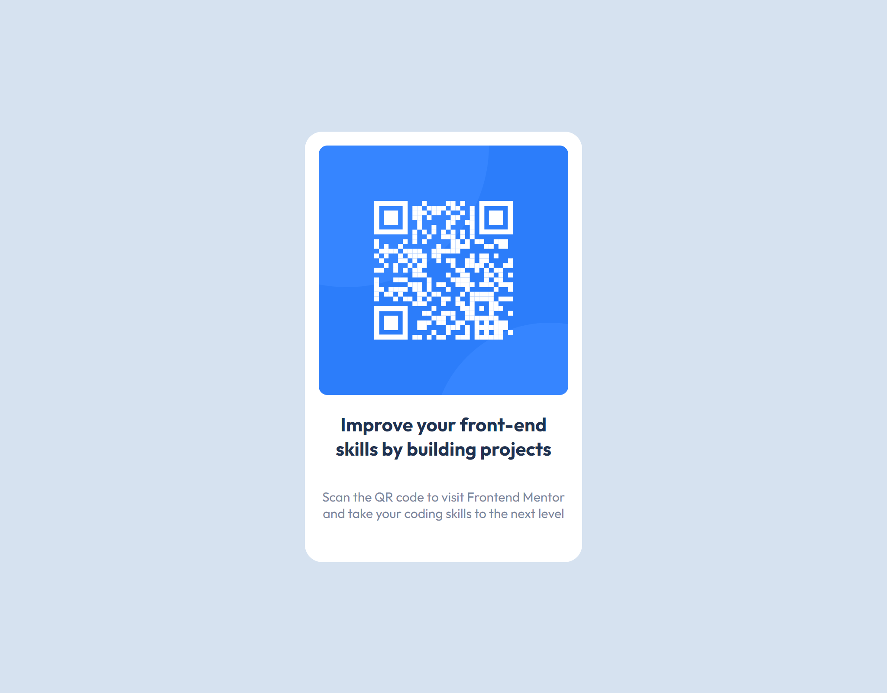

# Frontend Mentor - QR code component solution

This is a solution to the [QR code component challenge on Frontend Mentor](https://www.frontendmentor.io/challenges/qr-code-component-iux_sIO_H). Frontend Mentor challenges help you improve your coding skills by building realistic projects.

## Table of contents

- [Overview](#overview)
  - [Screenshot](#screenshot)
  - [Links](#links)
  - [Built with](#built-with)
  - [Continued development](#continued-development)
  - [Author](#author)

## Overview

My first challenge was to build a QR code component, getting it as close to the original design as possible.

### Screenshot

### Links

- Solution URL: [Github](https://github.com/Mrst12/frontend-mentor-qr-component)
- Live Site URL: [Live site](https://mrst12.github.io/frontend-mentor-qr-component/)

### Built with

- Semantic HTML5 markup
- CSS custom properties

### Continued development

I think I have probably gone too in depth with this challenge and it could be refactored to make it simpler, so I will focus more on this in the future. This was my first time using figma designs so that will be something I continue to get to grips with.

## Author

- Website - [Lisa Tinmurth](https://mrst12.co.uk/)
- Frontend Mentor - [@Mrst12](https://www.frontendmentor.io/profile/Mrst12)
- LinkedIn - [Lisa Tinmurth](https://www.linkedin.com/in/lisa-tinmurth)
